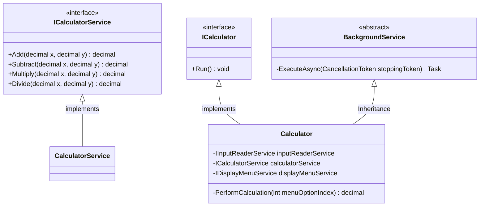
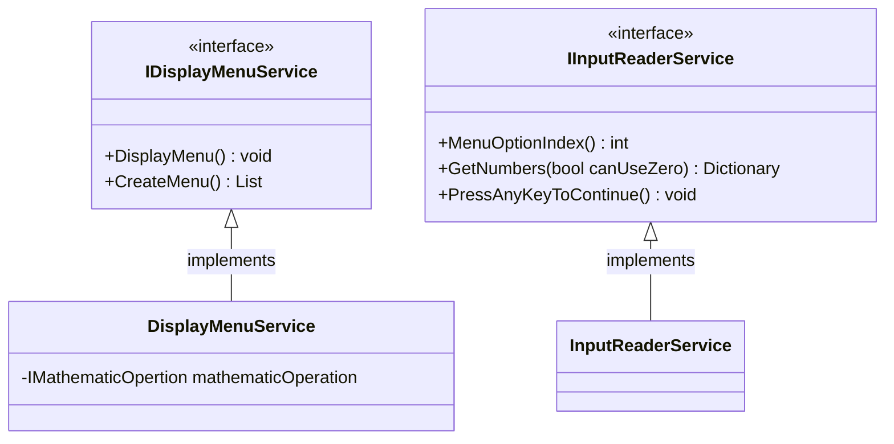
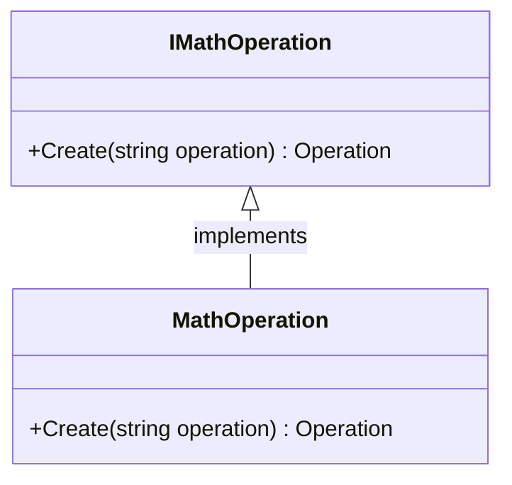
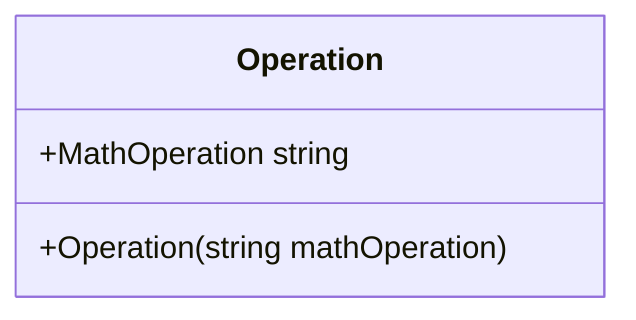

```mermaid
classDiagram
    class ICalculatorService {
        <<interface>> 
        +Add(decimal x, decimal y) decimal
        +Subtract(decimal x, decimal y) decimal
        +Multiply(decimal x, decimal y) decimal
        +Divide(decimal x, decimal y) decimal
    } 
        
    class CalculatorService {

    }

    class ICalculator {
        <<interface>> 
        +Run() void
    }

    class Calculator {
        -IInputReaderService inputReaderService
        -ICalculatorService calculatorService
        -IDisplayMenuService displayMenuService
        -PerformCalculation(int menuOptionIndex) decimal
    }

    class BackgroundService {
        <<abstract>>
        -ExecuteAsync(CancellationToken stoppingToken) Task
    }

    ICalculatorService <|--  CalculatorService : implements
    ICalculator <|-- Calculator : implements
    BackgroundService <|-- Calculator : Inheritance
```

```mermaid
classDiagram
    class IDisplayMenuService {
        <<interface>> 
        +DisplayMenu()  void
        +CreateMenu()  List<Operation>
    }

    class DisplayMenuService {
        -IMathematicOpertion mathematicOperation
    }

    class IInputReaderService {
        <<interface>> 
        +MenuOptionIndex()  int
        +GetNumbers(bool canUseZero)  Dictionary<string, decimal>
        +PressAnyKeyToContinue()  void
    }

    class InputReaderService {

    }

    IDisplayMenuService <|-- DisplayMenuService : implements
    IInputReaderService <|-- InputReaderService : implements
```

```mermaid
classDiagram
    class IMathOperation {
        +Create(string operation) Operation
    }

    class MathOperation {
        +Create(string operation) Operation
    }

    IMathOperation <|-- MathOperation : implements
```

```mermaid
classDiagram
    class Operation {
        +MathOperation string
        +Operation(string mathOperation)
    }
```
