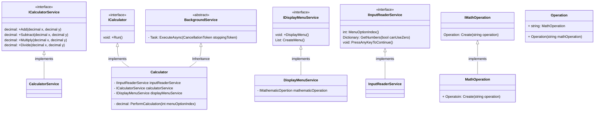

```mermaid
classDiagram
class ICalculatorService {
    <<interface>> 
    decimal: +Add(decimal x, decimal y)
    decimal: +Subtract(decimal x, decimal y)
    decimal: +Multiply(decimal x, decimal y)
    decimal: +Divide(decimal x, decimal y)
} 
    
    class CalculatorService {

    }

    class ICalculator {
        <<interface>> 
        void: +Run()
    }

    class Calculator {
        - IInputReaderService inputReaderService
        - ICalculatorService calculatorService
        - IDisplayMenuService displayMenuService
        - decimal: PerformCalculation(int menuOptionIndex)
    }

    class BackgroundService {
        <<abstract>>
        - Task: ExecuteAsync(CancellationToken stoppingToken)
    }

    class IDisplayMenuService {
        <<interface>> 
        void: +DisplayMenu()
        List<Operation>: CreateMenu()
    }

    class DisplayMenuService {
        - IMathematicOpertion mathematicOperation
    }

    class IInputReaderService {
        <<interface>> 
        int: MenuOptionIndex()
        Dictionary<string, decimal>: GetNumbers(bool canUseZero)
        void: PressAnyKeyToContinue()
    }

    class InputReaderService {

    }

    class IMathOperation {
        Operation: Create(string operation)
    }

    class MathOperation {
        + Operatoin: Create(string operation)
    }

    class Operation {
        + string: MathOperation
        + Operation(string mathOperation)
    }

    ICalculatorService <|--  CalculatorService : implements
    ICalculator <|-- Calculator : implements
    IDisplayMenuService <|-- DisplayMenuService : implements
    IInputReaderService <|-- InputReaderService : implements
    IMathOperation <|-- MathOperation : implements
    BackgroundService <|-- Calculator : Inheritance
```